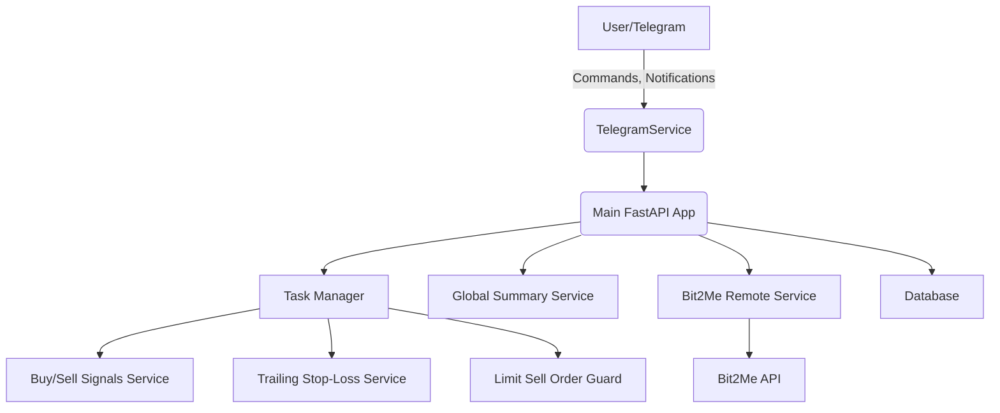

# Crypto Trailing Stop Bot

A Python-based bot for automated cryptocurrency trading with trailing stop-loss, analytics, and Telegram integration. Designed for Bit2Me exchange, it provides portfolio management, buy/sell signal automation, and real-time notifications.

---

## Features
- Automated trailing stop-loss for crypto assets
- Integration with Bit2Me API
- Buy/sell signal detection using technical indicators (RSI, volatility, etc.)
- Telegram bot for user interaction and notifications
- Portfolio summary and analytics
- Configurable background tasks and job scheduling
- OAuth login (Google)
- Modular, extensible architecture

---

## Architecture Overview


---

## Installation

### Prerequisites
- Python 3.13+
- Docker (optional, for containerized deployment)

### Clone the repository
```sh
git clone https://github.com/yourusername/crypto-stop-loss-bot.git
cd crypto-stop-loss-bot
```

### Install dependencies

You can use [uv](https://github.com/astral-sh/uv) for fast dependency installation (recommended):

```sh
uv sync
```

### Environment Setup
Copy `.env.example` to `.env` and fill in required values:
- Telegram bot token
- Bit2Me API credentials
- Google OAuth credentials

---

## Usage

### Local Development
```sh
python -m src.crypto_trailing_stop.main
```
Or, using Taskipy:
```sh
pip install taskipy
task start
```

### Docker Compose
```sh
docker-compose up --build
```

### API Endpoints
- FastAPI runs at `http://localhost:8000/`
- Interactive docs: `http://localhost:8000/docs`

### Telegram Bot
- Start the bot and interact via Telegram for notifications and commands.

---

## Configuration
All configuration is managed via environment variables (see `.env.example`). Key options:
- `TELEGRAM_BOT_TOKEN`: Telegram bot token
- `BIT2ME_API_KEY`, `BIT2ME_API_SECRET`: Bit2Me API credentials
- `GOOGLE_OAUTH_CLIENT_ID`, `GOOGLE_OAUTH_CLIENT_SECRET`: Google OAuth
- `DATABASE_PATH`: SQLite DB path
- `BACKGROUND_TASKS_ENABLED`: Enable/disable background jobs
- `TRAILING_STOP_LOSS_PERCENT`: Default trailing stop-loss percent

---

## Contributing
1. Fork the repository
2. Create your feature branch (`git checkout -b feature/YourFeature`)
3. Commit your changes (`git commit -am 'Add new feature'`)
4. Push to the branch (`git push origin feature/YourFeature`)
5. Open a pull request

Run tests and lint before submitting:
```sh
task test
```

---

## License
MIT License. See [LICENSE](LICENSE) for details.

---

## Author
José María Sola Durán (<josemaria.sola.duran@gmail.com>)

---

## Acknowledgements
- [Bit2Me](https://bit2me.com/)
- [FastAPI](https://fastapi.tiangolo.com/)
- [Aiogram](https://docs.aiogram.dev/)
- [APScheduler](https://apscheduler.readthedocs.io/)
- [CCXT](https://github.com/ccxt/ccxt)