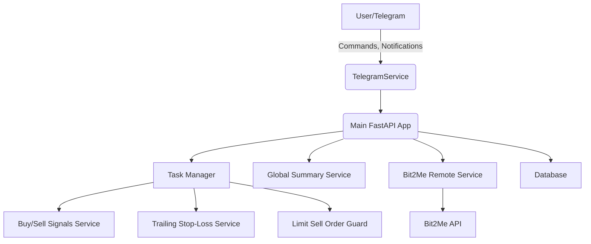

# Crypto Trailing Stop Loss Bot

<p align="center">
  <a href="https://github.com/jsoladur/crypto-stop-loss-bot/actions"></a>
  <a href="https://coveralls.io/github/jsoladur/crypto-stop-loss-bot"></a>
  <a href="https://opensource.org/licenses/MIT"></a>
  <br>
  <a href="https://www.python.org/downloads/release/python-3130/"></a>
  <a href="https://github.com/astral-sh/ruff"></a>
  <a href="https://pre-commit.com/"></a>
</p>

---

A Python-based bot for automated cryptocurrency trading with trailing stop-loss, analytics, and Telegram integration. Designed for Bit2Me exchange, it provides portfolio management, buy/sell signal automation, and real-time notifications.

---

## ⚠️ Disclaimer

> **This repository does *not* constitute investment advice.**  
> The creator of this crypto bot is **not responsible** for any financial gains or losses you may experience by using, modifying, or deploying this code. All actions you take based on this project are done **at your own risk**.  
> Cryptocurrency markets are volatile and unpredictable — **use this tool responsibly and with caution.**

---

## Features

### Core Trading Automation
- **Automated Trailing Stop-Loss**: Protects profits and limits losses by automatically adjusting stop-loss orders.
- **Buy/Sell Signal Detection**: Utilizes technical indicators (RSI, volatility, etc.) to identify potential trading opportunities.
- **Auto-Entry Trader**: Automatically executes buy orders based on detected market signals and user-defined configurations.
- **Limit Sell Order Guard**: Monitors and manages open sell orders to ensure they are executed as intended.

### User Interaction & Control
- **Interactive Telegram Bot**: Receive real-time notifications, issue commands, and check portfolio status directly from Telegram.
- **Secure Google OAuth Login**: Ensures secure access to the bot's functions with an authorized list of Google users.
- **On-Demand Market Metrics**: Fetch up-to-the-minute market data and technical indicators for any crypto symbol.
- **Manual Trade Triggers**: Manually initiate buy operations via the Telegram bot based on current metrics.

### Portfolio & Analytics
- **Comprehensive Portfolio Summary**: Get a global overview of your portfolio, including total deposits, withdrawals, and current value.
- **Historical Data Analysis**: Automatically processes multi-year transaction history from Bit2Me account summary exports.
- **Real-time Fiat Value**: Calculates the total value of your portfolio in your preferred fiat currency.

### System & Architecture
- **Exchange Integration**: Deep integration with the **Bit2Me API** for trading and account management, with data fetching capabilities from other exchanges via **CCXT**.
- **Dynamic Task Management**: Core features like trailing stop-loss and signal detection run as background tasks that can be enabled or disabled at runtime.
- **Modular & Extensible**: Designed with a clean, modular architecture that is easy to extend with new features and services.

---

## Architecture Overview


---

## Installation

### Prerequisites
- Python 3.13+
- Docker (optional, for containerized deployment)

### Clone the repository
```sh
git clone https://github.com/yourusername/crypto-stop-loss-bot.git
cd crypto-stop-loss-bot
```

### Install dependencies

You can use [uv](https://github.com/astral-sh/uv) for fast dependency installation (recommended):

```sh
uv sync
```

### Environment Setup
Copy `.env.example` to `.env` and fill in required values:
- Telegram bot token
- Bit2Me API credentials
- Google OAuth credentials

---

## Usage

### Local Development
```sh
python -m src.crypto_trailing_stop.main
```
Or, using Taskipy:
```sh
pip install taskipy
task start
```

### Docker Compose
```sh
docker-compose up --build
```

### API Endpoints
- FastAPI runs at `http://localhost:8000/`
- Interactive docs: `http://localhost:8000/docs`

### Telegram Bot
- Start the bot and interact via Telegram for notifications and commands.

---

## Backtesting with the CLI

The project includes a powerful command-line interface (CLI) for backtesting your trading strategies against historical data. This allows you to fine-tune parameters and evaluate performance before deploying the bot with real funds.

The backtesting process is a two-step process: first, you download the historical data for a specific cryptocurrency pair, and then you run the simulation with your desired strategy parameters.

### Step 1: Download Historical Data

Before you can run a backtest, you need to download the necessary historical candlestick (OHLCV) data. The CLI can fetch this data from various exchanges (like Binance, Kraken, etc.) via CCXT.

> **Note:** It's crucial to run this command first, as the backtesting tool relies on the locally saved data file.

Use the `download-data` command:

```sh
cli download-data <SYMBOL> [OPTIONS]
```

**Example:**

To download the last 2 years of 1-hour data for `ETH/EUR` from Kraken:

```sh
cli download-data ETH/EUR --exchange=(binance|kraken) --years-back=1
```

This will create a `.csv` file in the `data/` directory (e.g., `data/ETH_EUR.csv`).

### Step 2: Run the Backtest

Once you have the data, you can run the backtesting simulation using the `backtesting` command. This command allows you to configure various technical indicator parameters to see how they would have performed.

```sh
cli backtesting <SYMBOL> [OPTIONS]
```

**Example:**

To run a backtest for `ETH/EUR` with a 9/21 EMA crossover strategy, an ADX filter, and ATR-based take-profit enabled:

```sh
cli backtesting ETH/EUR --ema-short=9 --ema-mid=21 --adx-threshold=25 --enable-tp --sl-multiplier=2.0 --tp-multiplier=3.5 --filter-volume --volume-threshold=1.8
```

The CLI will output a summary of the backtest results, including net profit/loss, win rate, and the number of trades.

### Backtesting Parameters

| Parameter          | Type      | Default    | Description                                                                                                        |
| ------------------ | --------- | ---------- | ------------------------------------------------------------------------------------------------------------------ |
| `symbol`           | `string`  | **Required** | The symbol to backtest (e.g., `ETH/EUR`). Must match a downloaded data file.                                       |
| `--ema-short`      | `integer` | `9`        | Length of the short-period Exponential Moving Average (EMA).                                                       |
| `--ema-mid`        | `integer` | `21`       | Length of the mid-period EMA.                                                                                      |
| `--ema-long`       | `integer` | `200`      | Length of the long-period EMA, used as a trend filter.                                                             |
| `--filter-adx`     | `boolean` | `True`     | If enabled, uses the Average Directional Index (ADX) to filter out trades during choppy, non-trending markets.     |
| `--adx-threshold`  | `integer` | `20`       | The minimum ADX value required to consider a trend strong enough to open a trade.                                  |
| `--filter-volume`  | `boolean` | `False`    | If enabled, uses a relative volume filter to ensure trades are taken during periods of significant market activity. |
| `--volume-threshold` | `float`   | `0.5`      | The minimum relative volume required to open a trade.                                                              |
| `--enable-tp`      | `boolean` | `False`    | If enabled, the strategy will set a take-profit order based on the ATR.                                            |
| `--sl-multiplier`  | `float`   | `2.5`      | The multiplier for the Average True Range (ATR) to calculate the stop-loss distance.                               |
| `--tp-multiplier`  | `float`   | `3.5`      | The multiplier for the ATR to calculate the take-profit distance (only if `--enable-tp` is used).                  |
| `--initial-cash`   | `float`   | `3000`     | The starting cash amount for the simulation.                                                                       |
| `--show-plot`      | `boolean` | `False`    | If enabled, displays an interactive plot of the backtest results upon completion.                                  |
| `--debug`          | `boolean` | `False`    | If enabled, saves the dataframe with all calculated indicators to a `.csv` file for analysis.                      |

---

## Configuration
All configuration is managed via environment variables (see `.env.example`).

### Core & API
- `TELEGRAM_BOT_ENABLED`: Enable or disable the Telegram bot (`true`/`false`).
- `TELEGRAM_BOT_TOKEN`: Your Telegram bot's API token.
- `BIT2ME_API_KEY`: Your Bit2Me API key.
- `BIT2ME_API_SECRET`: Your Bit2Me API secret.

### Authentication
- `LOGIN_ENABLED`: Enables Google OAuth login for secure access (`true`/`false`).
- `AUTHORIZED_GOOGLE_USER_EMAILS_COMMA_SEPARATED`: Comma-separated list of Google emails allowed to log in.
- `GOOGLE_OAUTH_CLIENT_ID`: Your Google OAuth Client ID.
- `GOOGLE_OAUTH_CLIENT_SECRET`: Your Google OAuth Client Secret.

### Database
- `DATABASE_PATH`: Path to the SQLite database file (e.g., `db/prod.sqlite`).
- `DATABASE_IN_MEMORY`: If `true`, uses an in-memory database (primarily for testing).

### Background Jobs & Trading Logic
- `BACKGROUND_TASKS_ENABLED`: Master switch to enable/disable all background jobs (`true`/`false`).
- `JOB_INTERVAL_SECONDS`: Interval for running background jobs (if not using cron). Default: `300`.
- `TRAILING_STOP_LOSS_PERCENT`: Default percentage for the trailing stop-loss.
- `BUY_SELL_SIGNALS_RUN_VIA_CRON_PATTERN`: If `true`, runs the signal job on a cron schedule. If `false`, uses `JOB_INTERVAL_SECONDS`.
- `BUY_SELL_SIGNALS_ADX_THRESHOLD`: ADX value above which a trend is considered strong enough for a signal.
- `BUY_SELL_SIGNALS_4H_VOLATILITY_THRESHOLD`: Minimum ATR-to-price ratio to consider the 4H timeframe as non-choppy.
- `BUY_SELL_SIGNALS_1H_VOLATILITY_THRESHOLD`: Minimum ATR-to-price ratio to consider the 1H timeframe as non-choppy.

---

## Contributing

Contributions are welcome and greatly appreciated! Whether it's a bug report, a new feature, or an improvement to the documentation, every bit helps.

### Development Environment Setup

1.  **Fork the repository** on GitHub.
2.  **Clone your fork** locally:
    ```sh
    git clone https://github.com/yourusername/crypto-stop-loss-bot.git
    cd crypto-stop-loss-bot
    ```
3.  **Install dependencies**. This project uses uv for fast dependency management, which will install both production and development packages.
    ```sh
    uv sync
    ```
4.  **Set up your environment variables** by copying the example file and filling in the necessary values for local development.
    ```sh
    cp .env.example .env
    ```
5.  **Set up pre-commit hooks**. This will automatically run linters and formatters before each commit to ensure code quality and consistency.
    ```sh
    pre-commit install
    ```

### Contribution Workflow

1.  **Create a new branch** from `main`. Use a descriptive name, such as `feature/new-indicator` or `fix/telegram-bug`.
    ```sh
    git checkout -b feature/your-amazing-feature
    ```

2.  **Make your changes**. Write clean, readable, and well-documented code.

3.  **Run linters and tests** to ensure everything is working correctly. The pre-commit hooks run automatically on commit, but you can also run them manually:
    ```sh
    task lint  # Run all linters and formatters
    task test  # Run the test suite
    ```

4.  **Commit and push** your changes, then **open a Pull Request** to the `main` branch of the original repository. Provide a clear title and description for your PR, explaining the changes and linking to any relevant issues (e.g., `Fixes #123`).

---

## License
MIT License. See [LICENSE](LICENSE) for details.

---

## Author
José María Sola Durán (<josemaria.sola.duran@gmail.com>)

---

## Acknowledgements
- [Bit2Me](https://bit2me.com/)
- [FastAPI](https://fastapi.tiangolo.com/)
- [Aiogram](https://docs.aiogram.dev/)
- [APScheduler](https://apscheduler.readthedocs.io/)
- [CCXT](https://github.com/ccxt/ccxt)